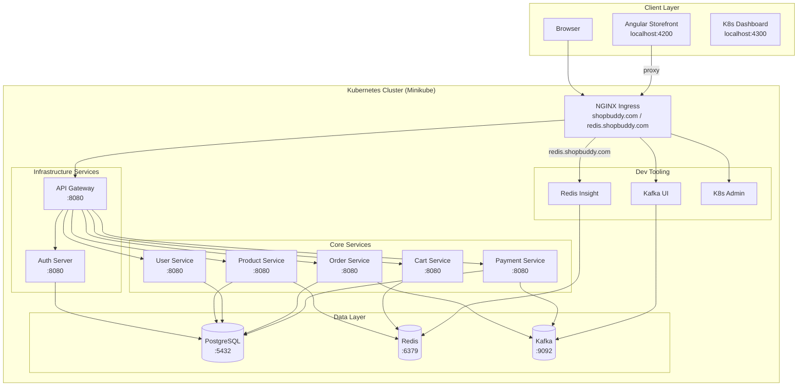
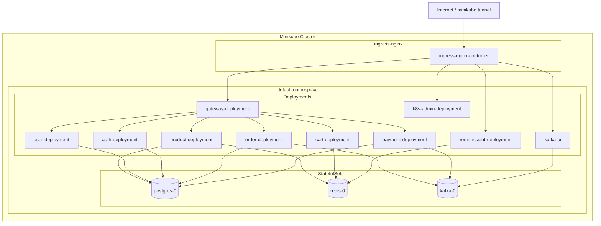
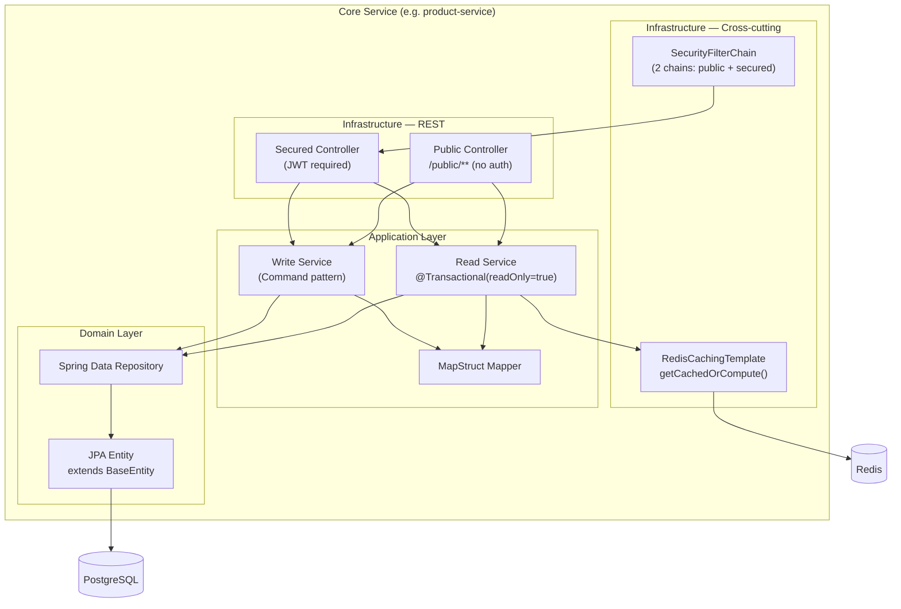
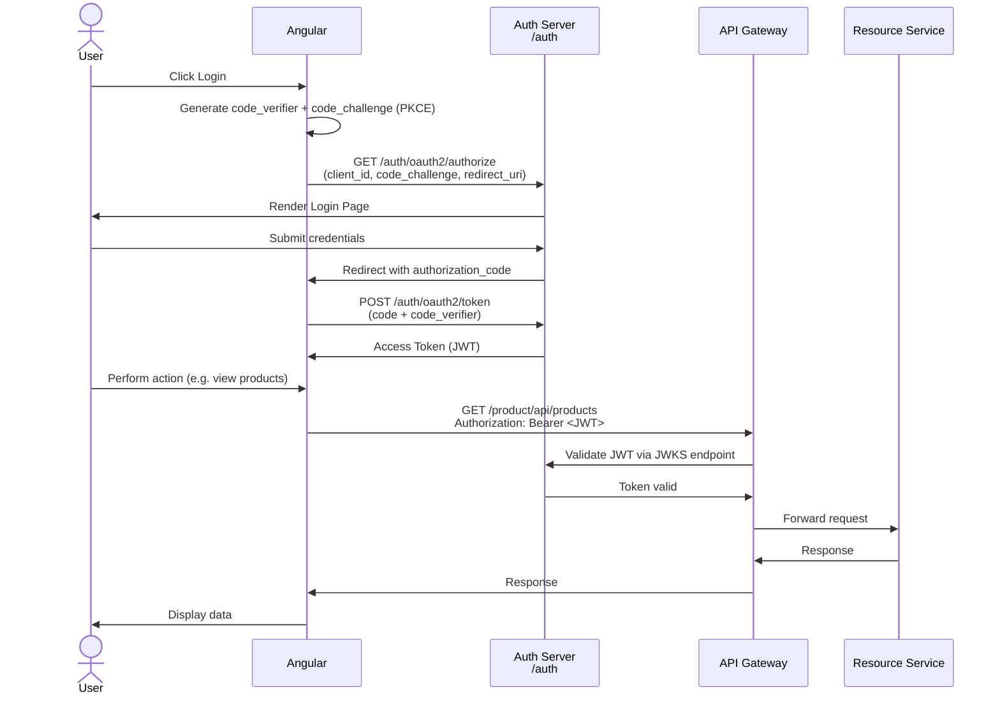
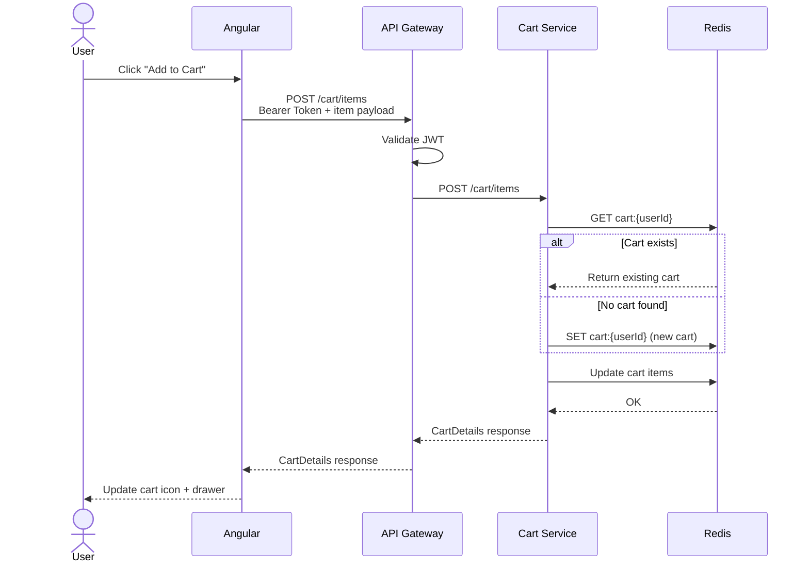
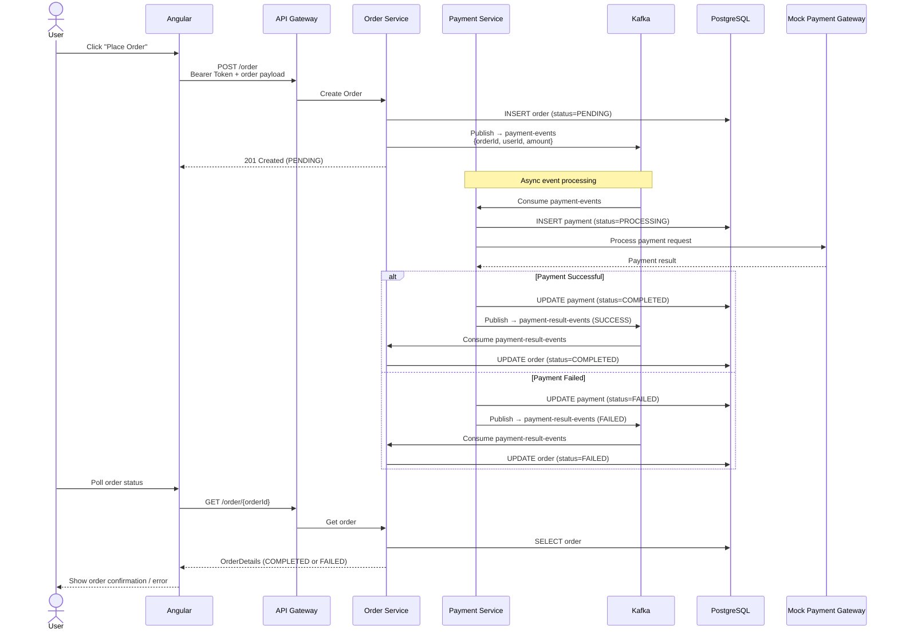
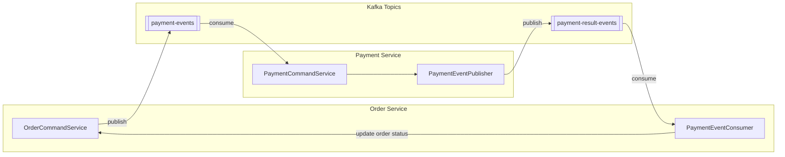
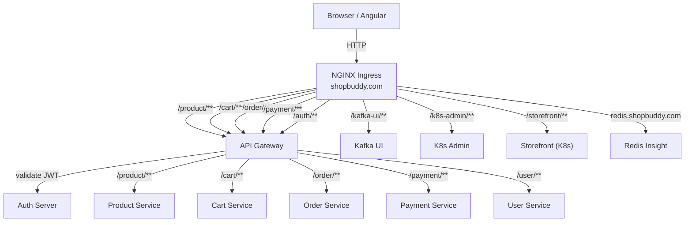
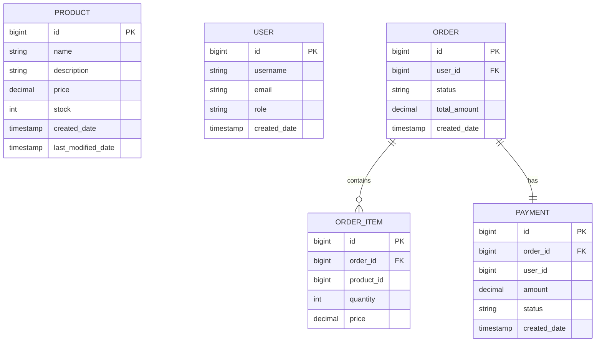
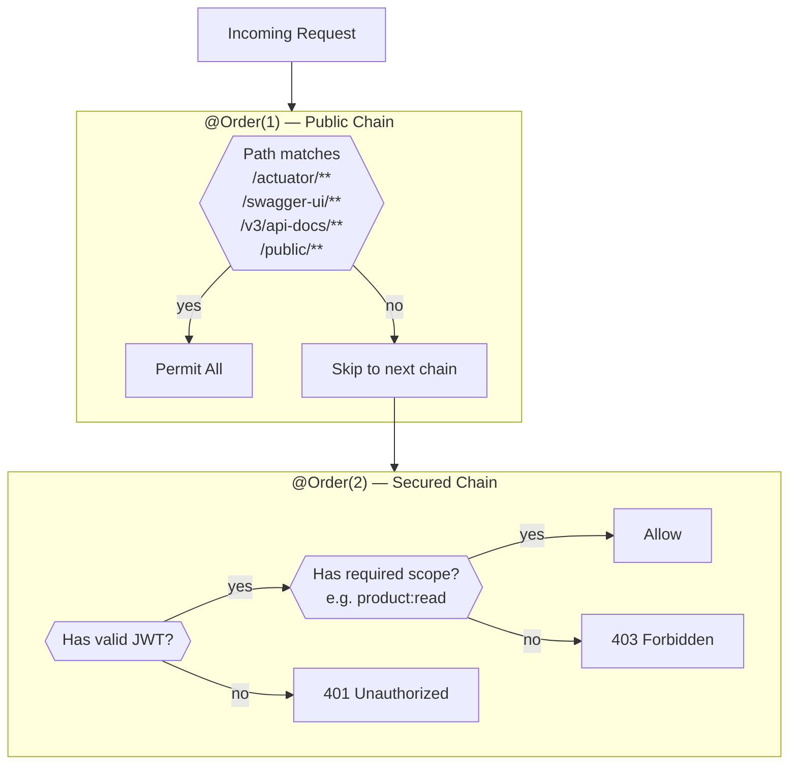

# ShopBuddy — Architecture & Flow Diagrams

---

## 1. High-Level System Architecture

---

## 2. Kubernetes Deployment Layout

---

## 3. Service Internal Architecture

Each core service follows the same layered pattern:

---

## 4. OAuth2 PKCE Authentication Flow

---

## 5. Add to Cart Flow

---

## 6. Checkout & Payment Flow

---

## 7. Kafka Event Flow

---

## 8. Request Routing (Ingress → Gateway → Services)

---

## 9. Database Layout (Conceptual)

---

## 10. Security Filter Chains

Each service has two `SecurityFilterChain` beans:

