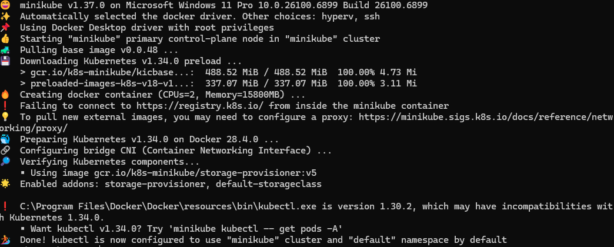

## 1. install kubectl

## 2. install minikube

`choco install minikube`

## 3. Start the cluster

minikube guid: https://minikube.sigs.k8s.io/docs/start/?arch=%2Fwindows%2Fx86-64%2Fstable%2Fchocolatey

`minikube start`


## 4. Interact with the cluster

Check kubectl cluster
`kubectl get po -A`

- check all pods in all namespaces

`minikube kubectl -- get po -A`

set alias

`alias mk="minikube kubectl --`

`Set-Alias mk 'minikube kubectl --'`

docker compose -f <compose.yaml> build --no-cache

& minikube -p minikube docker-env --shell powershell | Invoke-Expression

docker info

& minikube docker-env --unset --shell powershell | Invoke-Expression

kubectl --logs <pod_name>
or
(if container crashed too quickly, check previous logs)
kubectl --logs <pod_name> --previous

You need to access the service through Minikube's URL, not localhost:8080. Here's how:
Option 1: Get the Minikube service URL
bash# Get the URL for your service
minikube service product-service --url

```

This will give you something like `http://192.168.49.2:30123` - use that URL instead.

Then access:
```

http://192.168.49.2:30123/hello
Option 2: Port forward to localhost
bash# Forward port 8080 from the pod to your localhost
minikube kubectl -- port-forward pod/mypod 8080:8080
Now you can access http://localhost:8080/hello
Option 3: Use minikube tunnel (Windows)
bash# In a separate terminal, keep this running
minikube tunnel
Then get the service URL again.
Check if your pod is running first:
bash# Check pod status
minikube kubectl -- get pods

# Check logs

minikube kubectl -- logs mypod

# Check if the service is configured correctly

minikube kubectl -- get svc product-service
Why this happens:
Minikube runs in a VM/container, so localhost on your machine doesn't directly map to services inside Minikube. You need
to either:

Use Minikube's IP and NodePort
Port-forward the pod
Use minikube tunnel

The easiest is port-forwarding:
bashminikube kubectl -- port-forward pod/mypod 8080:8080
Then access http://localhost:8080/public/hello - this should work!