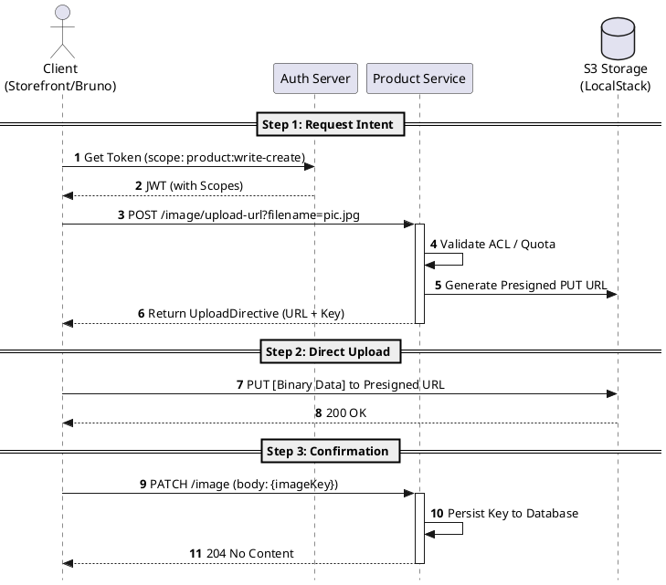
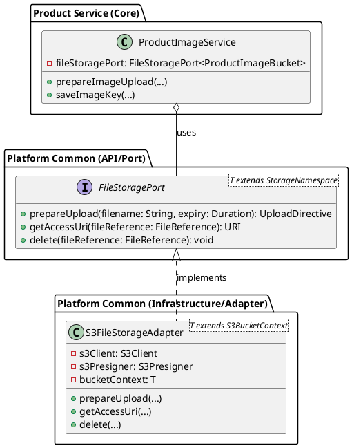

# Architectural Design: Cloud-Native File Storage Integration

**Status:** Draft / Active
**Owner:** Senior Architect / Engineering Team
**Last Updated:** April 26, 2026

## 1. Executive Summary
This document outlines the architecture for integrating object storage (S3) into the ShopBuddy ecosystem. The design prioritizes **high performance**, **scalability**, and **provider agnosticism** by leveraging a pre-signed URL strategy and the Hexagonal Architecture pattern.

---

## 2. Problem Statement
Handling file uploads (e.g., product images) through the backend services introduces several bottlenecks:
- **Resource Exhaustion:** Memory and CPU spikes due to multi-part body parsing.
- **Latency:** Double-hop overhead (Client -> API Gateway -> Service -> S3).
- **Security Risks:** Maintaining temporary local file buffers on server nodes.

---

## 3. Proposed Solution: The "Presigned-Direct-Confirm" Pattern
Instead of streaming files through the backend, we use a 3-step orchestration flow that empowers the client to talk directly to the storage provider securely.

### 3.1 Orchestration Flow (PlantUML)



---

## 4. Technical Design

### 4.1 Hexagonal Architecture (PlantUML)
The design follows the Ports and Adapters pattern to maintain provider neutrality.


### 4.2 Security Model
- **Short-Lived URLs:** Presigned URLs expire in 5-15 minutes by default.
- **Path Isolation:** Files are stored under `UUID/filename` to prevent name collisions and unauthorized discovery.
- **IAM-based Execution:** The `ProductService` uses limited IAM credentials to sign URLs, never exposing long-term secrets to the frontend.

---

## 5. Implementation Details (Product Service)

### 5.1 Configuration (`S3Config`)
Ensures LocalStack compatibility by enabling Path-Style access.

```java
@Bean
public S3Presigner s3Presigner(ProductImageBucket context) {
    return S3Presigner.builder()
        .region(Region.of(context.region()))
        .endpointOverride(URI.create(context.endpointOverride()))
        .serviceConfiguration(s -> s.pathStyleAccessEnabled(true))
        .build();
}
```

---

## 6. How to Extend

### 6.1 Adding a New Provider (e.g., Azure)
1. Create `AzureBlobStorageAdapter` in `platform/common`.
2. Implement `FileStoragePort`.
3. Swap the `@Bean` definition in the target microservice's configuration.

### 6.2 Image Post-Processing (Thumbnail Generation)
To implement thumbnails, we should follow an **Event-Driven** approach:
1. S3 bucket triggers an `ObjectCreated:Put` event.
2. An AWS Lambda (or a consumer service via SQS) catches the event.
3. The worker generates thumbnails and writes them back to a `thumbnails/` folder.
4. The database is updated asynchronously.

---

## 7. Future Improvements & Best Practices

1. **S3 Event Notification (S3 -> SQS -> Service):**
   Instead of the client confirming the upload (Step 3), the backend can wait for an S3 event notification to confirm the file is physically present. This is more robust against client-side failures.
   
2. **Content-Type Enforcement:**
   Add validation in `prepareUpload` to restrict file types (e.g., only `image/jpeg`) by signing the `Content-Type` header into the URL.

3. **Public Access Security:**
   For production, the bucket should be private. Access should be served through **CloudFront** with Origin Access Identity (OAI) or signed cookies for premium content.

4. **Lifecycle Policies:**
   Configure S3 lifecycle rules to automatically delete files in the `tmp/` folder that were never "confirmed" via the PATCH endpoint.

---

## 8. Usage Guide (Bruno / Frontend)

1. **Request URL:** `POST /api/v1/products/{id}/image/upload-url?filename=my-image.png`
2. **Execute Upload:**
   ```bash
   curl -X PUT --data-binary "@my-image.png" "RETURNED_PRESIGNED_URL"
   ```
3. **Confirm:** `PATCH /api/v1/products/{id}/image` with the returned key.
